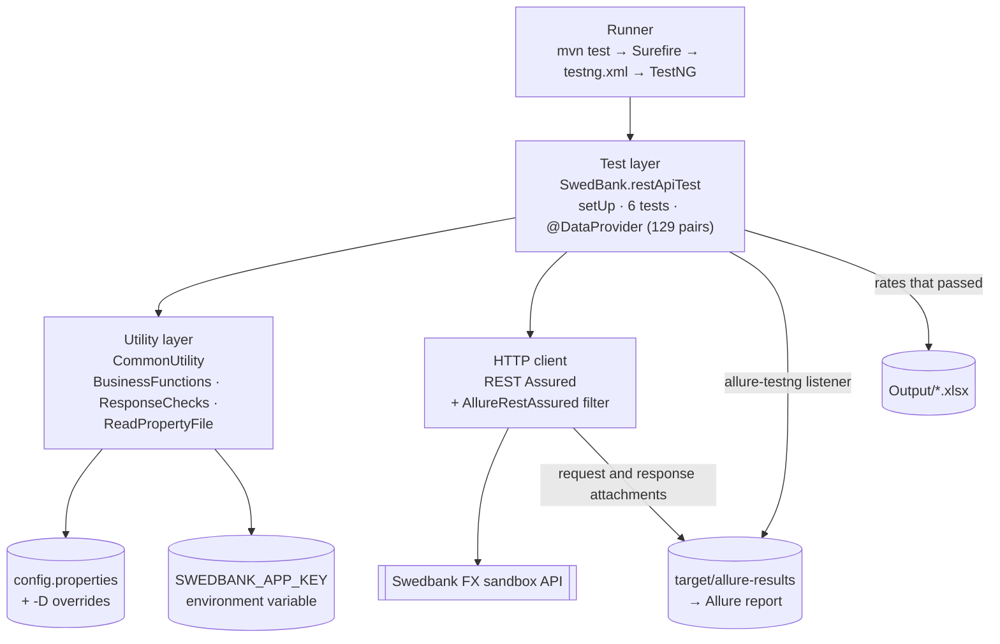
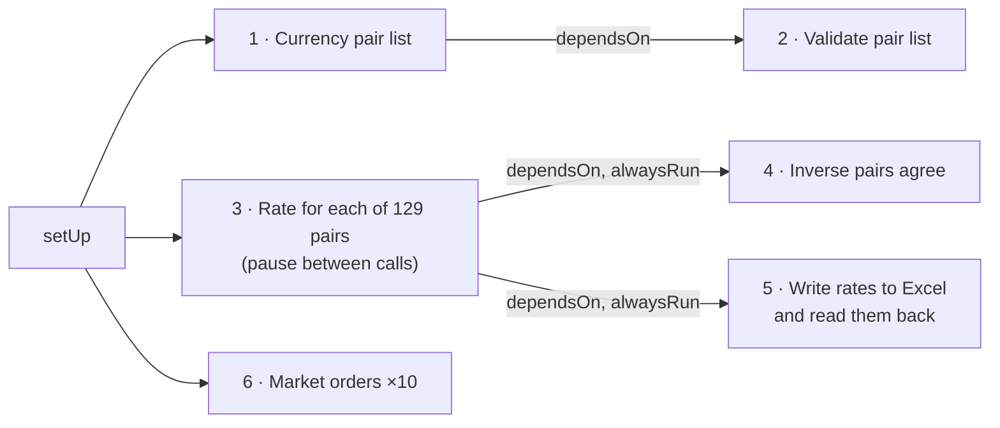

# Swedbank FX API tests

Automated API tests for the foreign-exchange (FX) endpoints of the [Swedbank PSD2 sandbox](https://developer.swedbank.com/). The suite checks the list of currency pairs, the indicative exchange rate for each of 129 pairs, and the market-order endpoint, then writes the rates to an Excel file and produces an Allure report.

Built with Java, TestNG and REST Assured, and run on GitHub Actions on every push.

## Contents

- [What is tested](#what-is-tested)
- [Framework design](#framework-design)
- [Project structure](#project-structure)
- [Running the tests](#running-the-tests)
- [Configuration](#configuration)
- [Rate limit](#rate-limit)
- [Reports](#reports)
- [Continuous integration](#continuous-integration)
- [Security](#security)
- [Known limitations](#known-limitations)

## What is tested

Base URL: `https://psd2.api.swedbank.com/partner/sandbox/v1/fx`

| # | Test (report name) | Endpoint | What it checks |
|---|---|---|---|
| 1 | Currency pair list returns 200 with JSON | `GET /indicative-rate/currencypairs` | The common checks below |
| 2 | Currency pair list is well formed and contains every expected pair | (response of test 1) | A non-empty JSON array; every entry is six capital letters with two different currencies; no duplicates; all 129 expected pairs present (extra pairs from the API are logged, not failed) |
| 3 | Indicative rate: `<PAIR>` (×129) | `GET /indicative-rate/rate?currencyPair=<PAIR>` | The common checks; `currencyPair` equals the requested pair; `bidRate` and `askRate` are positive numbers; bid is not above ask; spread under 5% of the mid rate; `rateTimestamp` is readable, at most 3 days old and not in the future |
| 4 | Inverse pairs agree | (rates from test 3) | For each pair whose inverse also passed (e.g. SEKNOK and NOKSEK), the two mid rates multiply to 1 within 1% |
| 5 | Rates written to Excel | none | Writes every rate that passed test 3 to `Output/ExcelResulCcyPairRate_<time>.xlsx`, then reads the file back and checks the header, row count, pairs, mid rates and timestamps |
| 6 | Market orders return a JSON list (call 1–10 of 10) | `GET /market-order/orders?date=<today>` | The common checks; the body is a JSON list (empty when there are no orders) |

**Common checks on every response** (`CommonUtility.ResponseChecks`): status 200, a JSON `Content-Type`, the `X-Request-ID` we sent echoed back, and a response time under 10 seconds. A 429 failure also says when the hourly limit resets.

Checks on fields within one response use TestNG's `SoftAssert`, so a single run reports every problem with that response, not just the first.

Every request sends a unique `x-request-id` header (a UUID) and the app key as the `app-id` query parameter.

## Framework design

The framework has three layers: TestNG runs the suite, the test class holds the test logic, and a small utility layer supplies configuration and shared helpers. REST Assured makes the HTTP calls, and Allure records every result.



### Layers

**Runner (Maven, Surefire, TestNG).** `mvn test` runs `testng.xml` through the Surefire plugin. TestNG decides the order using `priority` and `dependsOnMethods`, feeds the 129 currency pairs to the rate test through a `@DataProvider`, and repeats the market-order test with `invocationCount=10`.

**Test layer (`SwedBank.restApiTest`).** One class holds the six tests. `@BeforeClass setUp` loads everything the tests need once: the base URL, endpoint templates, header name, request delay and app key. It also registers the `AllureRestAssured` filter, so every request and response is attached to its test in the report. Shared state between tests, such as the pair-list response and the validated rates, is kept in static fields, so the suite runs in a single thread.

**Utility layer (`CommonUtility`).**
- `BusinessFunctions` holds the configuration key names, the `ccyPair` enum (the expected currency pairs), the app-key lookup from the environment, and helpers for request IDs and dates.
- `ResponseChecks` holds the checks every response must pass (status, content type, request ID, response time) and the failure message that explains a 429.
- `ReadPropertyFile` reads `config.properties` once and caches it. A value passed on the Maven command line as `-Dname=value` overrides the file, which is how CI and local runs change settings without editing it.

### Test flow



- **Test 2 depends on test 1.** If the list call fails, validation is skipped instead of failing on an empty response.
- **Tests 4 and 5 depend on test 3 with `alwaysRun=true`.** If some pairs fail, the rates that passed are still compared and written; if none passed (or no pair and its inverse both passed), the test is skipped.
- **A short pause follows every rate call** (`requestDelayMs`, 250 ms by default), even when the call fails.

### Design decisions

| Decision | Why |
|---|---|
| JSON is parsed with json-simple, not matched as text | Avoids false matches such as `EURSEKX` counting as `EURSEK` |
| Rates are checked as any `Number` | json-simple reads `1` as `Long` and `1.25` as `Double`; a cast to `Double` would crash on whole numbers |
| Mid rate is calculated as (bid + ask) / 2 | The API used to return `midRate`; it now returns only `bidRate` and `askRate` |
| Field checks use `SoftAssert` | One run shows every problem with a response, not just the first |
| Each assertion was proven to fail | A mock of the sandbox with one fault per check (swapped bid/ask, old timestamp, wrong request ID, 429, bad inverse rate, malformed pair list, non-list market orders) fails exactly those 7 tests; the same mock without faults passes all 143 |
| App key only from the `SWEDBANK_APP_KEY` environment variable | Keeps the key out of the repository; setup fails with a clear message if it is missing |
| `x-request-id` is a random UUID | A millisecond timestamp can repeat when two requests are sent in the same millisecond |
| Config values can be overridden with `-D` | Lets CI and local runs change the delay or base URL without editing files |
| Each Allure entry is named after its pair or call number | A failed currency pair is visible in the report list without opening every test |

## Project structure

```text
.
├── .github/workflows/tests.yml        GitHub Actions: run tests, build and upload reports
└── OpenBankAPI/                       Maven project
    ├── pom.xml                        Dependencies and build plugins
    ├── testng.xml                     TestNG suite definition
    ├── config.properties              Base URL, endpoint templates, header name, request delay
    ├── allurerc.mjs                   Allure 3 report settings (single-file report)
    └── src/test/
        ├── java/
        │   ├── SwedBank/restApiTest.java              The tests
        │   └── CommonUtility/
        │       ├── BusinessFunctions.java             Config keys, currency-pair enum, helpers
        │       ├── ResponseChecks.java                Checks every response must pass
        │       └── ReadPropertyFile.java              Reads config.properties, with -D overrides
        └── resources/allure.properties                Allure results go to target/allure-results
```

Generated when the tests run (not committed): `target/` (Surefire reports, Allure results and report) and `Output/` (Excel files).

## Running the tests

### Prerequisites

- JDK 17 (the version used in CI)
- Maven 3.9 or newer
- A Swedbank sandbox app key from the [Swedbank developer portal](https://developer.swedbank.com/)
- Node.js 22 or newer, only to build the Allure report

### Run

```bash
cd OpenBankAPI
export SWEDBANK_APP_KEY=<your sandbox app key>
mvn test
```

A full run makes 140 requests and takes about 2 minutes. To change the pause between rate calls:

```bash
mvn test -DrequestDelayMs=0
```

If `SWEDBANK_APP_KEY` isn't set, setup fails with a message saying so and the other tests are skipped.

### Build the Allure report

```bash
npx allure@3.20.0 generate target/allure-results
open target/allure-report/index.html
```

## Configuration

Settings live in `OpenBankAPI/config.properties`. Any of them can be overridden on the command line with `-Dname=value`.

| Setting | Default | Meaning |
|---|---|---|
| `baseURI` | `https://psd2.api.swedbank.com:443/partner/sandbox/v1/fx` | API base URL |
| `indicativeRateCcyPairURL` | `/indicative-rate/currencypairs?app-id=%s` | Currency-pair list endpoint |
| `indicativeRateSingleCcyPair` | `/indicative-rate/rate?currencyPair=%s&app-id=%s` | Single-rate endpoint |
| `marketOrderApiUrl` | `/market-order/orders?date=%s&app-id=%s` | Market-order endpoint |
| `headerNameCcyIndPair` | `x-request-id` | Name of the request-ID header |
| `requestDelayMs` | `250` | Pause after each rate call, in milliseconds |

The app key is not a setting: it comes only from the `SWEDBANK_APP_KEY` environment variable.

The expected currency pairs are the `ccyPair` enum in `BusinessFunctions.java`. When Swedbank adds or removes a pair, update the enum; test 2 lists any pairs the API returns that the enum doesn't have.

## Rate limit

Swedbank doesn't document the sandbox's rate limit, but every response reports it in headers:

```text
X-Rate-Limit-Limit: 200
X-Rate-Limit-Remaining: 193
X-Rate-Limit-Reset: 2675
```

That is about **200 requests per hour**; `X-Rate-Limit-Reset` is the number of seconds until the count resets. It is not a per-second limit: 30 requests sent back to back (about 2 a second) all succeeded. The count appears to be kept separately on several servers, so the remaining number can jump around between requests.

A full run makes 140 requests (1 pair list, 129 rates, 10 market orders), so one run fits within the hour. If a test gets a 429, its failure message includes the limit and how many seconds remain until it resets.

## Reports

| Report | Where | Contents |
|---|---|---|
| Allure | `target/allure-report/index.html` | Every test by name, pass/fail, error messages, and the HTTP request and response for each API call |
| Surefire | `target/surefire-reports/` | Standard Maven test results (XML and text) |
| Excel | `Output/ExcelResulCcyPairRate_<time>.xlsx` | Currency pair, bid, ask and mid rates (as numbers) and the rate timestamp for every rate that passed |

## Continuous integration

`.github/workflows/tests.yml` runs on every push and pull request, and on demand from the **Actions** tab.

1. Checks out the code and sets up JDK 17 with a Maven cache.
2. Fails straight away with a clear message if the `SWEDBANK_APP_KEY` secret is missing.
3. Runs `mvn test`. Runs never overlap: a new run waits for the one in progress (if several are waiting, only the newest runs), so pushes in quick succession can't use up the hourly limit together. Manual runs can set the pause between rate calls (`request_delay_ms`, default 250).
4. Replaces the app key with `***` in every report file. If the key is still found, nothing is uploaded.
5. Builds the Allure report and adds a pass/fail line to the run summary.
6. Uploads two artifacts: **allure-report** (open `index.html`) and **test-results** (Surefire reports and the Excel file).

**Setup:** add the app key as a repository secret named `SWEDBANK_APP_KEY` (Settings → Secrets and variables → Actions), or run:

```bash
gh secret set SWEDBANK_APP_KEY -R dipak-nehe/SwedeBank
```

## Security

- The app key is never stored in the repository. Locally it comes from your environment; in CI it comes from a repository secret.
- The key is part of every request URL, so it appears in request logs and Allure attachments. CI blanks it out of all reports before uploading them, because GitHub hides secrets in run logs but not inside artifacts.
- Older commits in this repository contain an app key that has since been removed from the code. Treat any key from the history as compromised and revoke it in the Swedbank developer portal.

## Known limitations

- **Runs against a live sandbox.** Results depend on the sandbox being up and its data; there is no offline mode in the repository.
- **Hourly request limit.** The sandbox allows about 200 requests an hour (see [Rate limit](#rate-limit)), and a full run makes 140, so more than one full run an hour can fail with 429 errors.
- **Single-threaded.** Tests share state through static fields, so they must not run in parallel.
- **Fixed pair list.** The expected pairs are hard-coded in the `ccyPair` enum and need updating when Swedbank's list changes.
